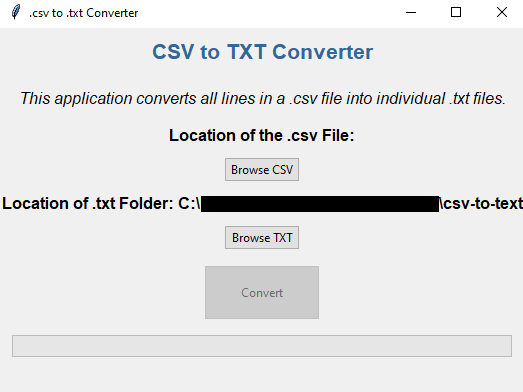

# Convert Files from CSV to TXT

This Python application provides a user-friendly interface to convert the content of a CSV file into individual TXT files. Each row in the CSV file is transformed into a separate TXT file, allowing for better organization and accessibility of data.



## Getting Started

To use the application, follow these steps:

1. Install Python and download this repository with the `git clone` command, or download it as a ZIP file.

2. Install the tkinter library with `pip install tkinter` for Windows and MacOS or `pip3 install tkinter` for Linux.

3. Run the Application with either `python App.py` for Windows or MacOS or `python3 App.py` for Linux. Alternatively, you can run the script by double-clicking the App.py file.

## How to Use

1. Select a CSV File
2. Select a Folder for where the txt Files will be created (It will be set to the current directory of the App.py file by default)
3. Press the Convert Button to start converting each line into a .txt file
4. The process should be complete once the progress bar is filled up and "Completed" is shown below it

## Output

The files generated will be stored within a dedicated folder, named through a combination of the CSV file name and the date and time of creation. For instance, the folder name may resemble `example_20240122001005`.

Inside each folder, there will be multiple TXT files, each named after the line number they represent. Lines without a corresponding TXT file are considered empty.

Each TXT file follows a structured format with lines formatted as `header: data`. Each new line in the file represents a cell in the corresponding row.

An example is given below:

```
id: 100
firstname: Roberta
lastname: Avi
email: Roberta.Avi@email.com
country: Tokelau
profession: worker
```

## Important Notes

Ensure that the selected CSV file is correctly formatted to avoid errors during conversion.

Currently, the only format supported is where the first row is headers, and the rest contain data. Below is an example CSV file:


